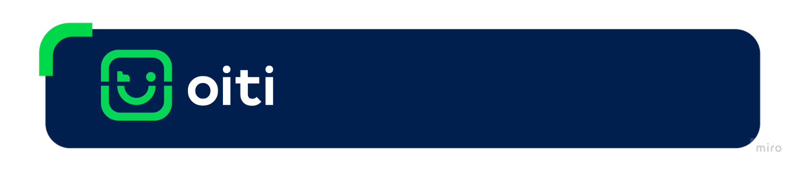

# Telas Customizadas para Mobile

Este repositório contém exemplos de telas customizadas dos produtos Oiti para mobile, sendo eles, Liveness 3D e Doc Core. Os sistemas operacionais disponíveis são em Android e iOS.

## Liveness 3D

Para as telas customizadas do Liveness 3D, utilize os links a seguir:

- [iOS](/iOS/Liveness3D/)
- [Android](/Android/Liveness3D/)

## Docore

Para as telas customizadas da DocCore, utilize os links a seguir:

- [iOS](/iOS/DocCore/)
- [Android](/Android/DocCore/)

## Customizações

Para documentação sobre a customização, utilizar os seguintes links:

- [iOS - Liveness 3D](https://devcenter.certiface.io/docs/customizacao-liveness3d-ios)
- [iOS - Doc Core](https://devcenter.certiface.io/docs/customizacao-doccore-ios)
- [Android - Liveness 3D](https://devcenter.certiface.io/docs/customizacao-telas-de-inicializacao-liveness3d-android)
- [Android - Doccore](https://devcenter.certiface.io/docs/doc-core-android)
